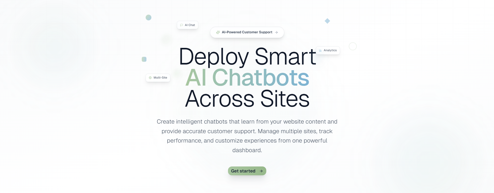
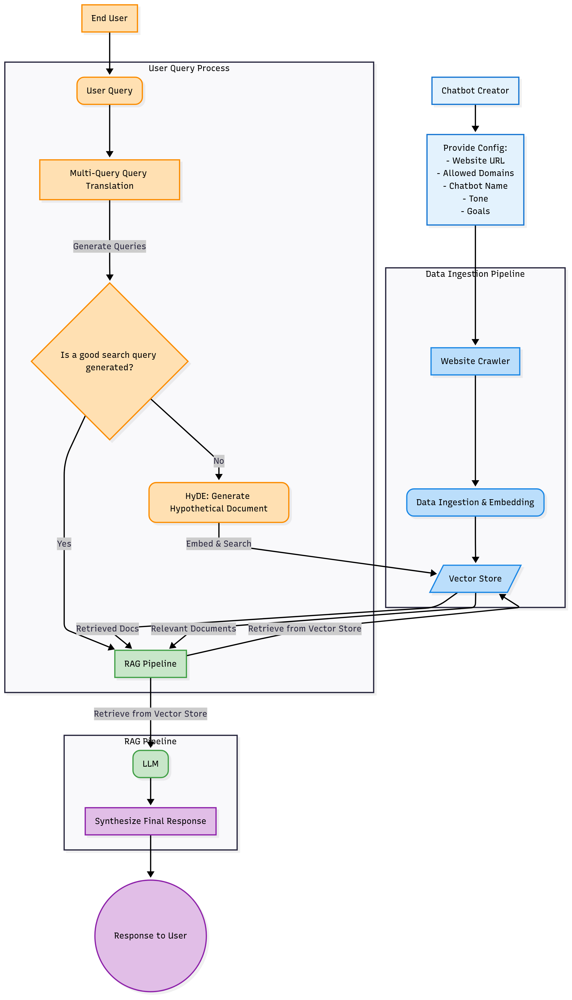

# SyncChat – AI Chatbots for Websites 🤖💬

### Paste a website URL → SyncChat crawls the content → Embed a context-aware AI chatbot.




---

## Overview 🌐

SyncChat is an AI-powered chatbot platform that enables users to create, deploy, and manage intelligent chatbots for their websites. It features a modern frontend, a Django backend, and a retrieval-augmented generation (RAG) pipeline that crawls and indexes website content to deliver accurate, context-aware responses and real-time analytics.


---

## Problem & Solution ⚡

**Problem ❌:** Embedding AI chatbots typically requires manual knowledge base creation and complex setup. Most solutions don’t handle context or multi-site management efficiently.

**Solution ✅:** SyncChat automatically crawls websites, generates embeddings, and serves chatbots through an embeddable widget. Multi-turn conversation context is preserved using a token-windowed memory system.

---

## Features ✨

- **Context-aware AI Chatbot 🤖:** Multi-turn conversations with dynamic memory.
- **Zero Setup 🛠️:** Paste a URL, and the knowledge base builds automatically.
- **Multi-Site Management 🌍:** Manage multiple chatbots in one dashboard.
- **Embeddable Widget 🖼️:** Lightweight JS script, safe to include anywhere.
- **Personalization 🎨:** Tone, language, and goals per chatbot.
- **Analytics 📈:** Track chats/day, user satisfaction, and trending questions.
- **Integrations 🔗:** Export conversations to CSV, Slack, Notion.
- **Feedback Loop 🔁:** Collect user ratings to refine responses.

---

## Architecture 🏗️




---

## Tech Stack 🛠️

- **Backend:** Python, Django, Django REST Framework, ChromaDB, Google Gemini, PostgreSQL-ready
- **Frontend:** Next.js, React, TypeScript, Tailwind CSS
- **Widget:** Vanilla JS, Vite
- **Testing:** Django test framework, Jest + React Testing Library, Cypress for widget

---

## RAG (Retrieval-Augmented Generation) Pipeline 🧠

SyncChat uses a robust RAG pipeline for context-aware answers:

- **Crawling & Chunking:**  
  Website content is crawled ([backend/rag/crawler.py](backend/rag/crawler.py)) and split into semantic chunks (~400 tokens) using custom heuristics and BeautifulSoup.

- **Embeddings:**  
  Chunks are converted into vector embeddings via [Sentence Transformers](https://huggingface.co/sentence-transformers/all-MiniLM-L6-v2) ([backend/rag/embeddings.py](backend/rag/embeddings.py)), stored in [ChromaDB](https://www.trychroma.com/).

- **Retrieval:**  
  Relevant chunks are fetched from ChromaDB using multi-query and HyDE strategies ([backend/rag/retrieval.py](backend/rag/retrieval.py)).  
  - Multi-query RAG: Generates diverse reformulations of the user query for improved recall.
  - HyDE fallback: If not enough context is found, a hypothetical answer is generated and used for retrieval.

- **Prompt Construction:**  
  Context from previous turns is concatenated to provide multi-turn conversations. The prompt is dynamically tailored to the chatbot’s tone and goals ([backend/user/views.py](backend/user/views.py)).

- **LLM Response:**  
  The final answer is generated using Google Gemini (via [google.generativeai](https://ai.google.dev/)), with the response returned as JSON for downstream processing.

---

### Backend

The backend is the core engine of the platform, built with Django to provide secure, scalable, and efficient management of users, chatbots, and chat interactions. It orchestrates authentication, bot configuration, conversation handling, and seamless integration with the RAG pipeline.

- **User Authentication:**  
  Implements robust user authentication and authorization, ensuring that only registered users can access bot management and chat functionalities. Security measures include encrypted password storage and session management.

- **Chatbot Management:**  
  Allows users to create and configure chatbots with custom settings, including specifying allowed domains to restrict where bots can be deployed. Each chatbot is assigned a unique embed code for easy integration into websites. The backend enforces domain restrictions and manages bot-specific configurations.

- **Chat System:**  
  Handles real-time chat interactions using Gemini. Maintains detailed conversation history for each user and bot, enabling context-aware responses and analytics. Conversation logs are securely stored and can be accessed for review and improvement.

- **Interaction with RAG Pipeline:**  
  Coordinates with the RAG pipeline by storing and serving embedded website content. When a chat request is received, the backend retrieves relevant documents and context from the RAG system to enhance response accuracy and relevance.


---

### Dashboard

The dashboard is the main interface for users to manage and monitor their AI chatbots, providing actionable insights and controls for optimization.

- **Chatbot & Conversation Management:**  
  Users can view, create, and edit chatbots, access recent conversations, and review detailed histories. Modal dialogs allow for in-depth bot and conversation details, including business info, support goals, and language settings.

- **Performance & Analytics:**  
  Displays key metrics such as total conversations, average response times, satisfaction rates, and active chatbot count. Interactive charts visualize conversation volume, response times, issue resolution, satisfaction scores, and language distribution.

- **Real-Time Updates & User Tools:**  
  Features live updates on bot status and user activity, with user-friendly tools for filtering data, selecting date ranges, and quickly navigating between chatbots, conversations, and analytics.


---


## Setup ⚡

### Backend

```sh
cd backend
python -m venv venv
source venv/bin/activate
pip install -r requirements.txt
cp .env.example .env
python manage.py migrate
python manage.py runserver
```

### Frontend

```sh
cd frontend
npm install
npm run dev
```

### Widget

```sh
cd chat-widget
npm install
npm run build
```

### Embed in a website

```html
<script src="chat-widget.js" data-embed-code="YOUR_EMBED_CODE"></script>
```

---

## Testing & Performance 🧪

- **Unit Tests ✅:** Validate RAG logic and embeddings retrieval.
- **Integration Tests 🔗:** Ensure API endpoints respond correctly.
- **Widget Tests 🖥️:** Cross-browser rendering, XSS protection, and performance (load < 200ms).
- **Coverage 📊:** 85%+ backend & frontend coverage.

---

## Roadmap / Unique Features 🚀

- Incremental Website Updates 🔄: Auto-refresh embeddings when content changes.
- Semantic Search Optimizations 🧠: Reduce irrelevant matches using context weighting.
- Advanced Analytics 📊: Heatmaps for most asked questions and response accuracy.
- Multi-language Support 🌐: Automatic translation and embeddings for global websites.
- Offline Widget Mode 🌙: Partial caching for low-connectivity environments.

---

## License 📄

Apache 2.0 — see LICENSE
